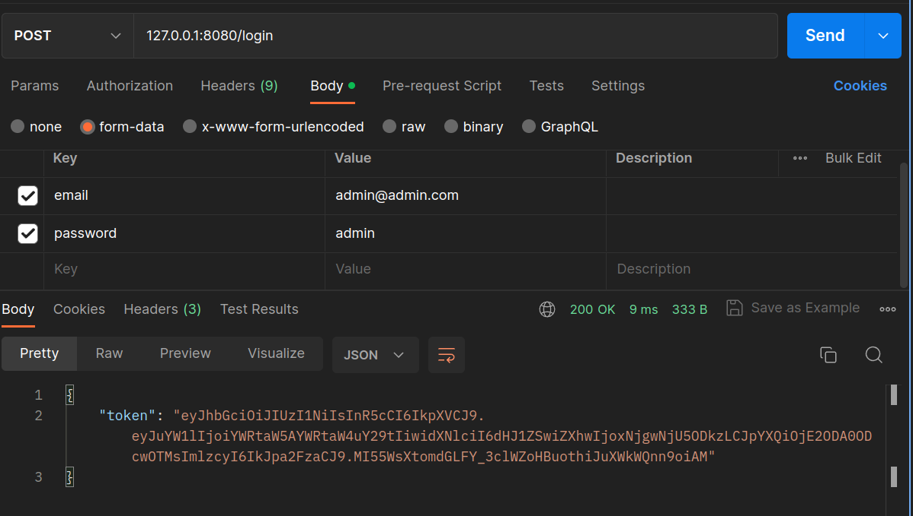

# JWT authentication In Golang with gin

## Introduction

JWT or JSON Web Token is an industry standard defined by RFC7519 that aims to compactly and securely transmit or store JSON objects between different applications. The JWT is digitally signed using a secret key with the HMAC algorithm or an RSA or ECDSA public and private key pair.

The JSON Web Token is used in two main scenarios, when we want to carry out an authorization process in our application or when we want to exchange information, below we detail a little more about the use of JWT in each of the mentioned scenarios.

Autorização: Este é o cenário mais comum para o uso do JWT. Depois que o usuário estiver autenticado, cada requisição subsequente incluirá o JWT, permitindo que o usuário acesse rotas, serviços e recursos permitidos com esse token.

Information Exchange: JSON Web Tokens are a good way to transmit information securely between parties. As JWTs can be signed, for example using public and private key pairs, we can guarantee that senders are who they say they are.

## Structure

A JWT is composed of three parts, the header, the payload and the signature, all of which are written in JSON, and are encoded using Base64.

The header specifies whether the token will be signed, and if so which algorithm is used for the signature using the mandatory alg (algorithm) declaration. It can also contain the optional typ (media type) and cty (content type) declarations.

````
{
"alg": "HS256",
"typ": "JWT"
}
````

The payload can contain any type of data relevant to the application, there are no mandatory declarations.

````
{
"sub": "1234567890",
"name": "John Doe",
"admin": true
}
````

The signature consists of encoding and encrypting the header, payload and a secret. This field is used to prove the authenticity of a token, preventing it from being modified by a malicious agent.

## Test the source code

````
go mod tidy
````

````
make run/api
````

The application will run by default on port 8080. With Postmain you can test the receipt of the token as shown in the figure below.

